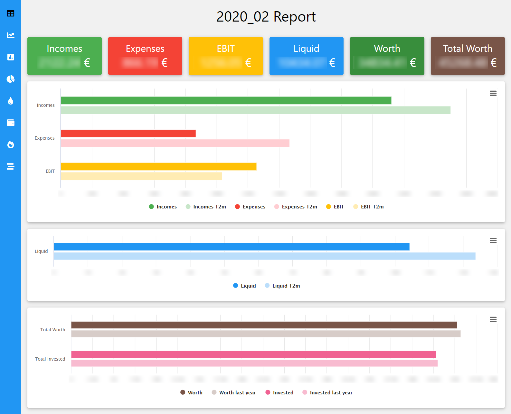
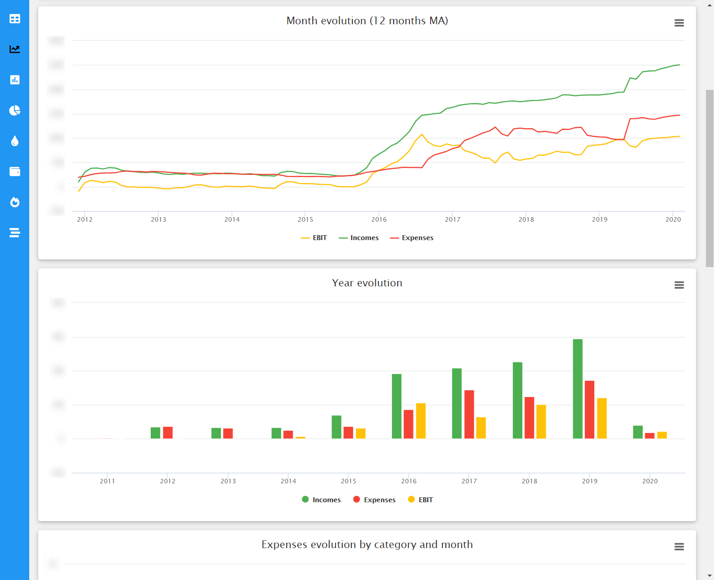
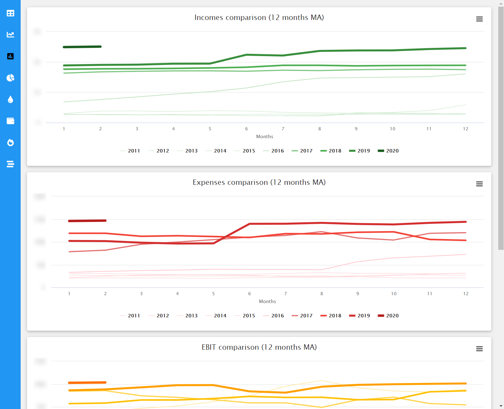
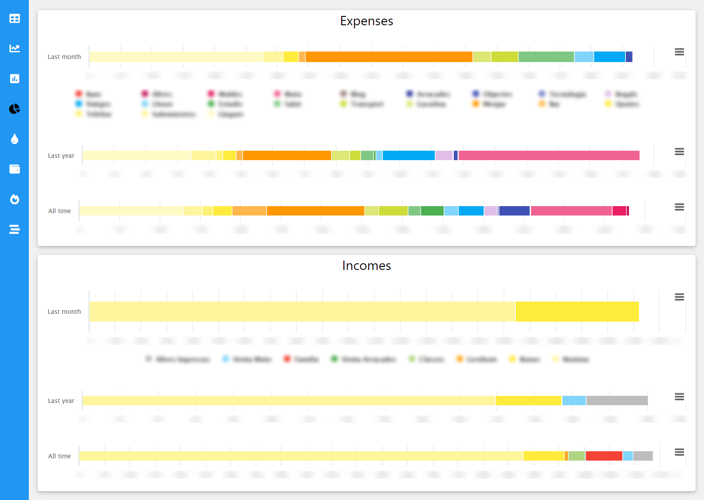
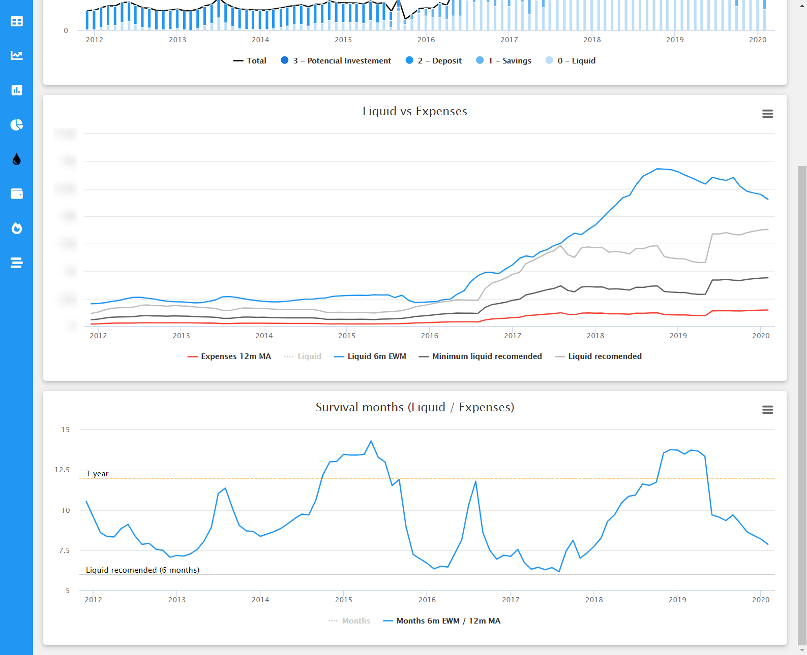
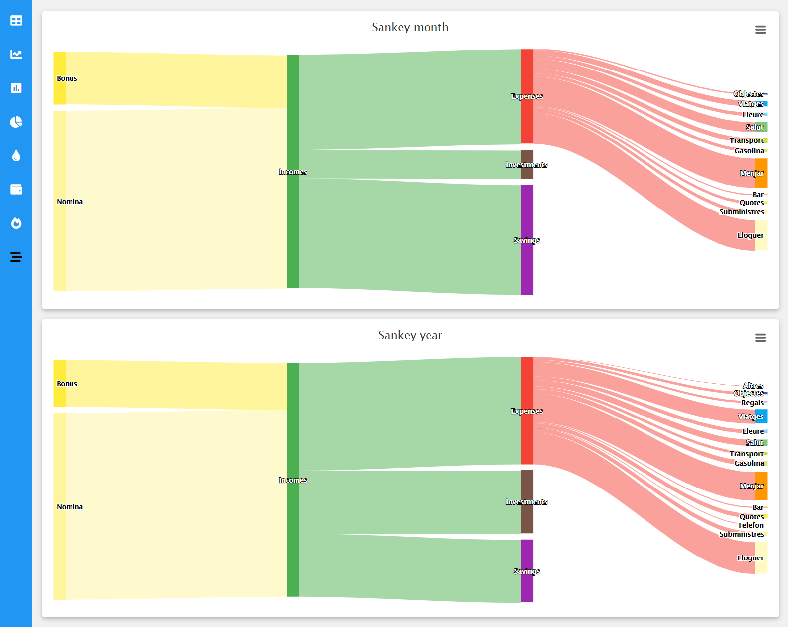
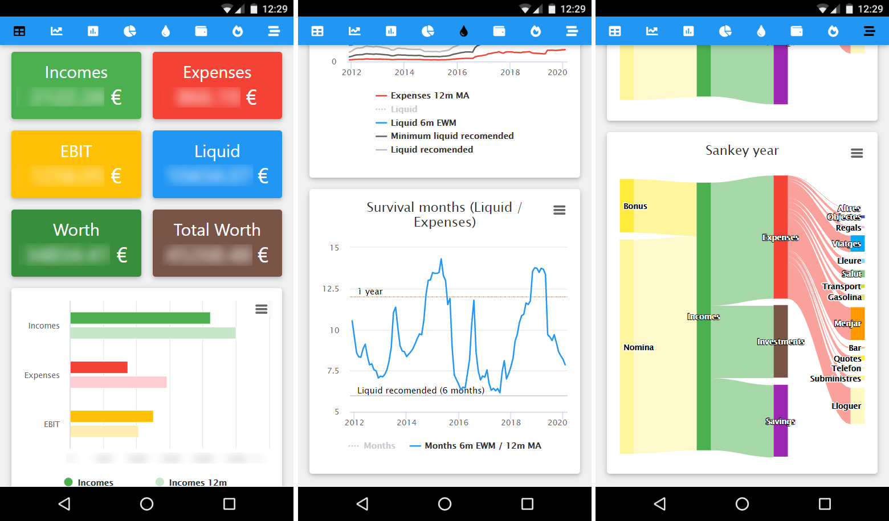

# Personal Assistant with Luigi

This repository contains different **Luigi** DAGs that allows me to automate repetitive tasks.

I have created a `StandardTask` that extends the **Luigi** original task so that it is really easy to add new tasks.

What you basically need to do is to create a new task with the following code:

```python
class ReportsTask(StandardTask):
    module = "reports"
    priority = 80

    def requires(self):
        yield MoneyLoverTask(self.mdate)
```

And you need a `script` or `package` inside the `src` folder that has a function called `main`.
Essentially what **Luigi** will do is:

```python
module = __import__(self.module)
module.main(self.mdate)
```

You can read more about it [here](https://villoro.com/post/luigi).

## Tasks

### Expenses/Incomes Report

Since 2010 I have been recording all expenses and incomes. For the last years I have been using [Money Lover](https://moneylover.me/) to do so.
This app has a way to export the data as an Excel file. But the problem is that it does not have the format I want.
So the first task is to clean that data (`clean data`).

With the data cleaned the idea is to create a custom html report using **Jinja2** templates.

In order to make it more flexible there are two tasks:

1. `Extract info` that creates a `yaml` with the info
2. `Create Report` that creates the `html` report with the `yaml` data

With this approach is easy to modify the data or the template without needing to modify the other.

So the pipeline is as follows:


As you can see I use **dropbox** for storing all data this way is easy for me to access or modify it.

The report itself uses [W3css](https://www.w3schools.com/w3css/) for the layout and [Highcharts](https://www.highcharts.com/) for charts.

Here you can see some of the pages the report have:








And of course the report is **responsive**:




### Flights

I regularly travel to Italy and I want to do it as cheap as possible.
So I thought the best way to do it was to let the assistant track all the prices between the airports I wanted and store that data.
Then I could use **Data Analysis** or **Machine Learning** to minimize the price I pay for the flights.

To do so I used the **Rapid API** [Flight Search](https://rapidapi.com/skyscanner/api/skyscanner-flight-search) app.
This API allowed me to query some pairs of airports daily for free.
So right now the assistant is storing a year of data each day so that I can see prices changes and which company offers cheaper flights each day.


As you can see **Rapid API** is getting their data from **Skyscanner**.

A sample of the data:


## Authors
* [Arnau Villoro](villoro.com)

## License
The content of this repository is licensed under a [MIT](https://opensource.org/licenses/MIT).

## Nomenclature
Branches and commits use some prefixes to keep everything better organized.

### Branches
* **f/:** features
* **r/:** releases
* **h/:** hotfixs

### Commits
* **[NEW]** new features
* **[FIX]** fixes
* **[REF]** refactors
* **[PYL]** [pylint](https://www.pylint.org/) improvements
* **[TST]** tests
